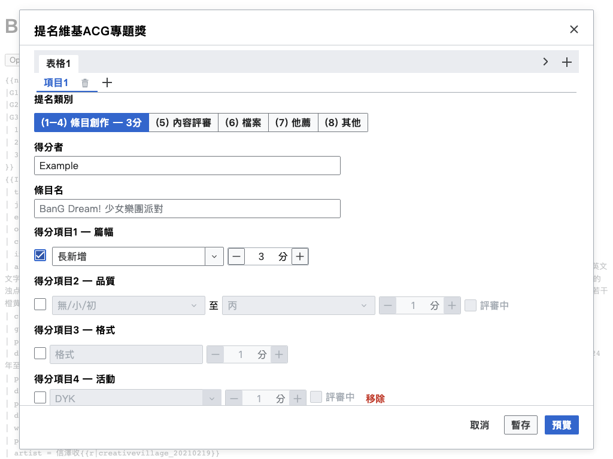
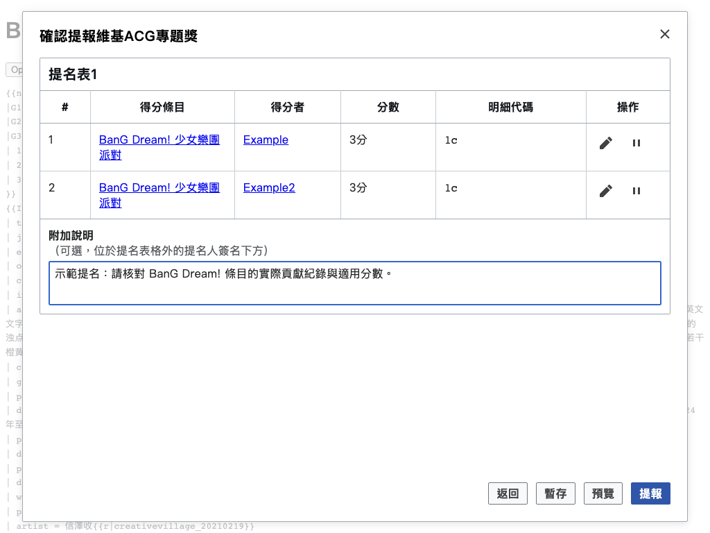

# ACGATool

[English](README.md) · [繁體中文](README.zh-Hant.md) · [简体中文](README.zh-Hans.md)

Nominate and review contributions for the Chinese Wikipedia ACG WikiProject award. Original tool by **[SuperGrey](https://zh.wikipedia.org/wiki/User:SuperGrey)**.

<!-- toc:start -->

## Contents

- [Features](#features)
- [Installation](#installation)
- [How to use](#how-to-use)
- [Screenshots](#screenshots)
- [Help](#help)
- [License](#license)

<!-- toc:end -->

## Features

- Prepare multiple nominations, organize them into tables, freeze items, and review the batch before submitting.
- Save drafts across pages and browser tabs; select from the five exclusive rule groups: 1–4, 5, 6, 7, and 8.
- Check nominations in batches, with undo/redo and a final registration-page and score-list update.
- Use suggested recipients and article assessment information while checking the actual contribution history.

## Installation

Install the readable [Tampermonkey userscript](https://github.com/For-Each-Next/wp-acga-tool/releases/latest/download/acga_tool.user.js), or copy the latest [MediaWiki gadget](https://github.com/For-Each-Next/wp-acga-tool/releases/latest/download/acga_tool.min.js) into your Chinese Wikipedia `Special:MyPage/common.js`. Choose one installation method, then reload Wikipedia. Submissions use your logged-in wiki account. [All releases](https://github.com/For-Each-Next/wp-acga-tool/releases).

To remove the tool, disable its Tampermonkey entry or remove its code from `common.js`, then reload Wikipedia.

## How to use

Open an article, its talk page, a file page, or the award registration page and choose **Nominate to ACGA** from the page tools. Select a recipient and scoring rules, then choose **Preview** to review the complete nomination. Submit only after checking the proposed entries.

**Save draft** stores your work locally. **Cancel** discards unsaved form changes while retaining explicitly saved drafts. During batch checking, accepted items remain local until you finish the batch; read partial-failure messages before retrying.

## Screenshots

Offline examples based on the article source of **BanG Dream! 少女樂團派對** (revision 94028176). Recipients, scores, banners, and API results are simulated; screenshots do not claim a live assessment.

[Source attribution and modifications](THIRD-PARTY-NOTICES.md#documentation-article-fixture).

## Help

See the [usage guide](docs/usage.md) for nominations, reviews, drafts, and recovery. The interface follows your Wikipedia language: English, Traditional Chinese, or Simplified Chinese.

Contributor information is in [CONTRIBUTING.md](CONTRIBUTING.md).

## License

The [MIT license](LICENSE) preserves Copyright (c) 2025 Quinn Gao and SuperGrey’s original credit. AI-assisted maintenance makes no additional copyright claim. See [third-party notices](THIRD-PARTY-NOTICES.md).
